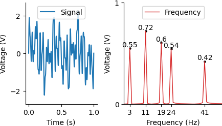
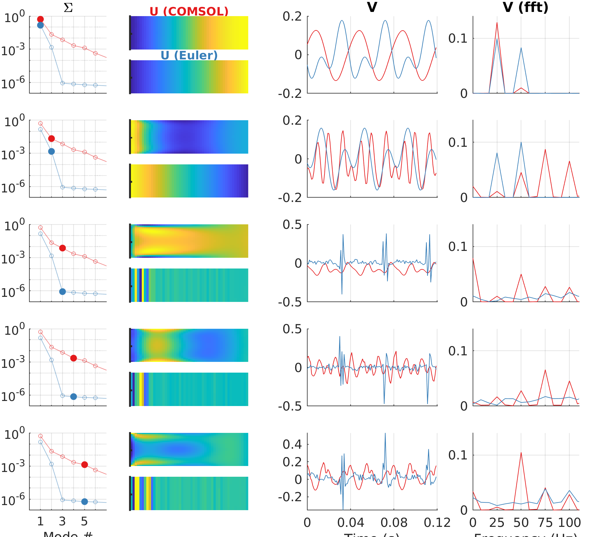

# scientific_figures

This repository contains example figures made with Python and MATLAB. 

The data for the figures can be found in the /data folder. Figures are saved in the /figs folder. 

## Dependencies
The MATLAB code was developed on MATLAB R2020a, but it should run on later versions as well. 

To run the python notebook, you will need Python3, jupyter notebook and a few other packages. You can install the packages with the requirements file: 

    pip install -r requirements.txt 

If you don't have python3 installed, you can run the notebook in the cloud. E.g. with . 

 
## Figure previews

Figure made with fft_figure.ipynb

Figure made with figure_SVD.m